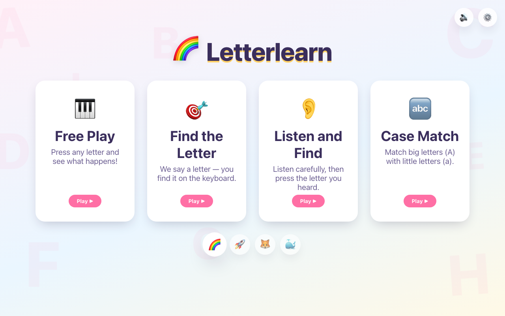
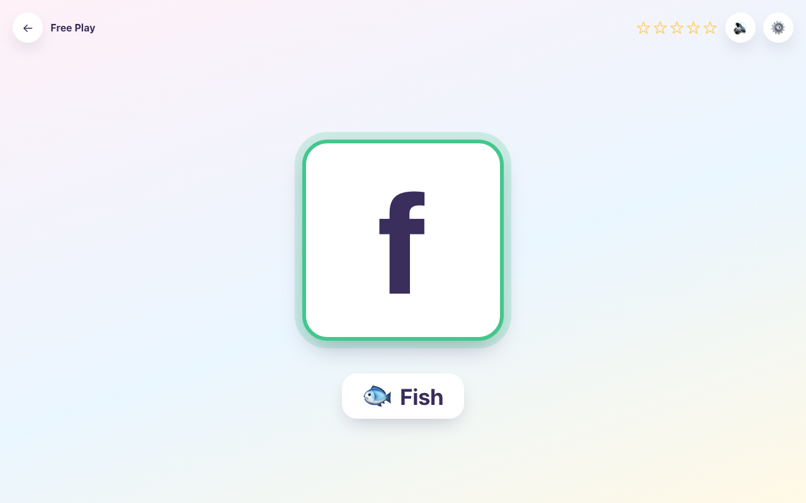
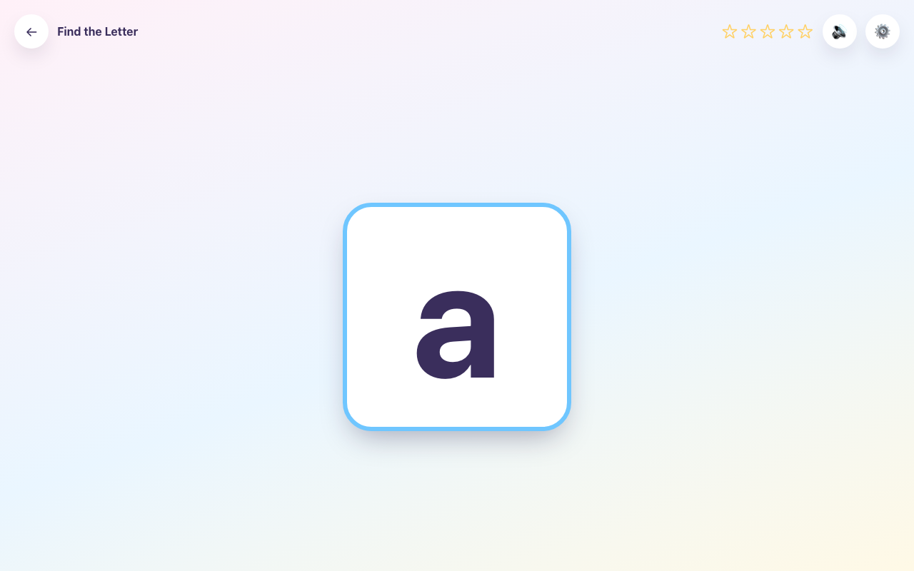

# Letterlearn

一款面向 4–5 岁儿童的英文字母键盘学习游戏，无广告、无账号、无数据上传。

游戏涵盖：认识 A–Z、关联英文单词、区分大小写，以及认识 0–9 和英文数字名；在真实键盘上找到对应键、听到发音——全程正向反馈，没有惩罚机制。

完全在浏览器本地运行，所有数据存储于 `localStorage`，不依赖后端，儿童数据永远不离开设备。

---

[English README](README.en.md)

---

## 截图

| 主页 | 自由探索 | 找字母 |
|------|----------|--------|
|  |  |  |

## 快速启动

```bash
./run.sh        # 自动安装依赖并启动 Vite 开发服务器
```

或手动执行：

```bash
npm install
npm run dev
```

## 构建与预览

```bash
npm run build      # 类型检查 + 构建到 dist/
npm run preview    # 本地预览生产构建
```

## 测试

```bash
npm run test        # 运行完整测试套件（vitest run）
npm run test:watch  # 监听模式
```

## 游戏模式

首页先选择 **Letters（字母）**、**Numbers（数字）** 或 **Mixed（字母＋数字）**。字母学习可直接选择 **Uppercase ABC（大写）／Lowercase abc（小写）／Mixed Aa（大小写混合）**，新用户默认大写，已有大小写偏好保留。

数字支持自由探索、找数字、听音找键，不提供大小写匹配。按 `0`–`9`（含 NumLock 开启的小键盘）显示数字、英文名称和对应数量的圆点，`0` 显示空点阵。每次只读一次数字名称，点击数字或单词卡可重听。

**Mixed** 支持自由探索、找键（Find the Key）和听音找键，在同一轮练习字母和数字。随机出题交替选择两类内容，并在每类内部保留错题优先；顺序出题按所选范围交错排列（如 `A、0、B、1`，某类用完后继续另一类）。大小写只影响字母；字母播放字母名＋单词，数字只读一次。家长设置中可同时调整两类范围，混合学习沿用各项已有进度。

家长设置可选择 `0–9`、`0–5`、`6–9` 或自定义数字范围。字母和数字的范围分别保存，学习记录按当前内容展示；旧版设置和记录自动兼容。自由探索允许当前类别的所有键，练习范围用于出题模式。

出题模式使用无需阅读的反馈：答对立即显示绿色勾和金色星星，答错显示橙色重试图形并轻轻摇动目标，配合不同的短音效。每题累计两次有效错误后显示键盘位置提示；按对后立即收起。已获得的星星不会因答错减少，正确输入始终可立即重试。静音和减少动画时，图形反馈仍保留。

| 模式 | 说明 |
|------|------|
| **自由探索** | 按任意字母键，依次听字母名和单词；卡片持续显示，点击字母或单词卡可重听 |
| **找字母** | 听到"按 A"后在键盘上找到并按下对应键，按错有轻柔提示 |
| **听音找键** | 字母隐藏，只听声音判断，支持重听 |
| **大小写匹配** | 看到 `A` 找到 `a`，可设置仅大写、仅小写或混合练习 |

## 功能特性

- **A–Z 完整字母库**：每个字母配有儿童友好的英文单词、emoji 和发音文件（`src/data/letters.ts`）
- **预录音频**：每个字母、单词、提示语和大小写配对短语均有美音（US）和英音（GB）两套录音
- **音效设置**：总开关、字母朗读、单词朗读、音效、背景音乐（说话时自动降低音量）、音量调节、口音切换、声音测试
- **鼓励系统**：8 种鼓励语 + 6 种庆祝动画（彩纸、星星、彩虹、气球、吉祥物舞蹈、贴纸），支持 `prefers-reduced-motion`，含连对计数器
- **4 种视觉主题**：彩虹王国、太空冒险、动物森林、海洋世界，可在主页或家长设置中切换，本地持久化
- **家长设置**：通过简单算术题验证身份（防止孩子误入），可配置练习模式、字母大小写、练习字母范围（预设或自选）、每轮题数（5/10/15/无限）、自动跳题开关及延迟、显示单词/emoji 开关、减少动画、音效设置、主题、清除学习记录
- **本地学习记录**：按字母记录尝试次数、答对次数、错误次数、当前连对和最佳连对，以星级展示（需练习 / 进步中 / 已熟悉）
- **智能出题**：不重复出刚答过的字母，优先出近期出错的字母，连对多了自动降低出现频率
- **键盘防抖**：忽略长按重复事件、修饰键组合、表单内输入；错误连击有 800ms 冷却，正确答案始终即时响应；Caps Lock 不影响判断
- **无障碍**：大尺寸交互目标、可见焦点状态、`aria-live` 结果播报、无纯色信号、无倒计时、无失败惩罚

## 架构说明

无路由库，`App.tsx` 维护单一 `page` 状态（`"welcome" | "game"`）切换页面。两个持久状态从顶层向下传递：`useSettings()`（所有游戏设置，基于 `useLocalStorage`）和 `useProgress()`（各字母学习进度，基于 `progressService`）。

游戏核心状态机为 `useGameSession`（`hooks/useGameSession.ts`），状态流转如下：

```
idle → presenting → waitingForInput → correctFeedback | incorrectFeedback
     → showingWord → celebration → nextQuestion → (presenting...)
```

`generation` 计数器在模式切换或组件卸载时使所有未完成的异步任务（音频 Promise、定时器）立即失效，避免旧回调污染新题状态。`hasScoredRef` 确保每道题只记录一次，即使在提示音未播完时就按了正确键也不会重复计分。

```
src/
  components/   LetterDisplay, WordCard, ModeCard, CelebrationLayer,
                SoundControls, ThemeSelector, ParentSettings (+ ParentGate),
                ProgressStars
  pages/        WelcomePage, GamePage
  hooks/        useKeyboardInput, useSpeech, useGameSession,
                useLocalStorage, useSettings, useProgress
  services/     audioService（音频播放）, progressService（localStorage 读写）
  data/         letters, themes, encouragements, defaultSettings
  types/        game.ts（GameSettings, LetterProgress, QuestionPhase, ...）
  utils/        random, wait, letterSelection（带权重的字母选择器）
  styles/       tokens.css（设计 token）, global.css
```

## 发音系统

`services/audioService.ts` 从 `public/audio/{us,gb}/` 播放预录的 `.m4a` 音频，涵盖每个字母、单词、"Press X" 提示语和大小写配对短语，由 `scripts/generate-audio.sh` 使用 macOS `say` 命令生成并作为静态资源提交——线上运行无需依赖浏览器实时语音合成 API。

学习语音分别使用字母名和单词录音，各自遵守朗读开关。自由探索在字母与单词之间短暂停顿；找字母、听音找键答对后只读单词。上述流程不播放自然拼读或整句反馈，答错使用轻音效和视觉提示。

没有 `SpeechSynthesis` 兜底：音频加载或播放失败时静默继续。中断播放也会结束对应等待任务，避免重听导致流程卡住。打开家长设置会暂停学习流程并停止朗读；听音模式在静音、字母朗读关闭或音量为零时显示目标字母。

播放串行化：开始新片段会结束并取消当前播放，已结束或取消的回调不会影响新片段，连续快速按键不会导致两个声音叠加。背景音乐在任何语音或音效播放时自动降低音量，播放结束后恢复。

重新生成音频（例如修改了单词后），在 macOS 上运行：

```bash
./scripts/generate-audio.sh
```

数字录音使用独立脚本，只生成 `number-0.m4a` 到 `number-9.m4a`，不覆盖字母录音：

```bash
npm run audio:numbers -- --dry-run            # 查看计划，无需凭据
npm run audio:numbers                         # 使用 .env 中的火山引擎配置，生成 US/GB 两套
npm run audio:numbers -- --accent us --force   # 重新生成美音数字
```

## 测试覆盖

| # | 场景 | 测试文件 |
|---|------|----------|
| 1 | 按正确键触发成功反馈 | `hooks/useGameSession.test.ts` |
| 2 | 按错误键不推进题目 | `hooks/useGameSession.test.ts` |
| 3 | 非字母键被忽略 | `hooks/useKeyboardInput.test.ts` |
| 4 | Caps Lock 不影响答题判断 | `hooks/useKeyboardInput.test.ts` |
| 5 | 自由探索模式显示按下的字母 | `hooks/useGameSession.test.ts` |
| 6 | 关闭音效时不调用语音接口 | `hooks/useSpeech.test.ts` |
| 7 | 设置读写 localStorage | `hooks/useLocalStorage.test.ts` |
| 8 | 字母选择器不连续出同一字母 | `utils/letterSelection.test.ts` |
| 9 | 打开家长设置时暂停键盘监听 | `pages/GamePage/GamePage.test.tsx` |
| 10 | 庆祝动画结束后自动跳题 | `hooks/useGameSession.test.ts` |
| 11 | 组件卸载时键盘监听器被清除 | `hooks/useKeyboardInput.test.ts` |
| 12 | 单字母自定义范围不死循环 | `utils/letterSelection.test.ts`, `hooks/useGameSession.test.ts` |

所有涉及游戏逻辑的测试均 mock 了 `services/audioService`，不依赖真实 `<audio>` 或 `SpeechSynthesis`，可完全离线运行。

## 扩展游戏

**新增主题** — 在 `src/data/themes.ts` 的 `THEMES` 中添加条目（`id`、`name`、`description`、`icon`、`decorations`、`celebrationIcon`），再在相关 CSS 文件中添加 `[data-theme="your-id"]` 样式规则。新主题会自动出现在 `ThemeSelector` 中并持久化。

**新增庆祝动画** — 在 `src/data/encouragements.ts` 中添加 id 到 `CelebrationAnimationId` 和 `CELEBRATION_ANIMATIONS`，再在 `components/CelebrationLayer/CelebrationLayer.tsx` 中添加对应的 Framer Motion 分支（含 `reducedMotion` 兜底）。

**修改字母对应单词/emoji** — 编辑 `src/data/letters.ts` 中对应条目，保持 `audioSlug` 为小写、连字符分隔的文件名安全字符串，然后将同名 `.m4a` 文件放入 `public/audio/us/` 和 `public/audio/gb/`（或重新运行 `scripts/generate-audio.sh`）。
